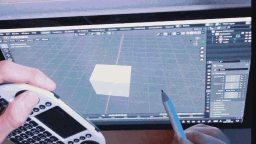

# What's this

- Blender's Rotation, Zoom-in-out and  Pan is operated by left-hand device(Micro keyboard).

# Environment I confirmed

- Windows 10
- AutoHotkey_1.1.33.10

# How to use

- Download AutoHotkey. [Link](https://www.autohotkey.com/)
- Install AutoHotkey.
- Download the script named "MyHotKeysNoComment.ahk" from this github repository.
- Edit the script to your preference in your text editor.
- Execute the script (probably double click *.ahk file).

# Youtube

- https://youtu.be/dIIDCtZm9Fk
